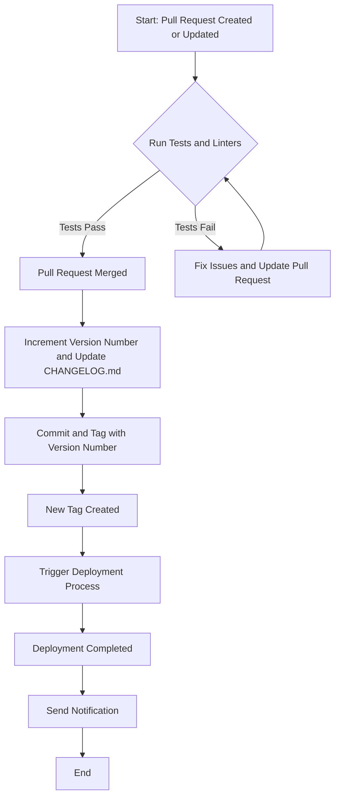

# CI/CD

# Requirements:

- git `main` branch must only composed of released versions (tags)
- each change ending merged in main needs to:
	- change the semver version number
	- update the change log with corresponding description
	- tag that commit with corresponding version number

