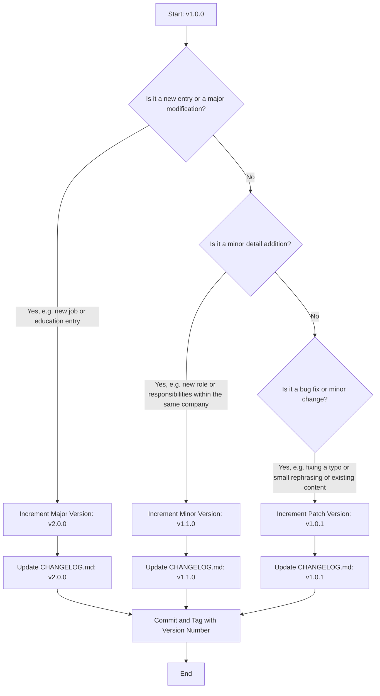
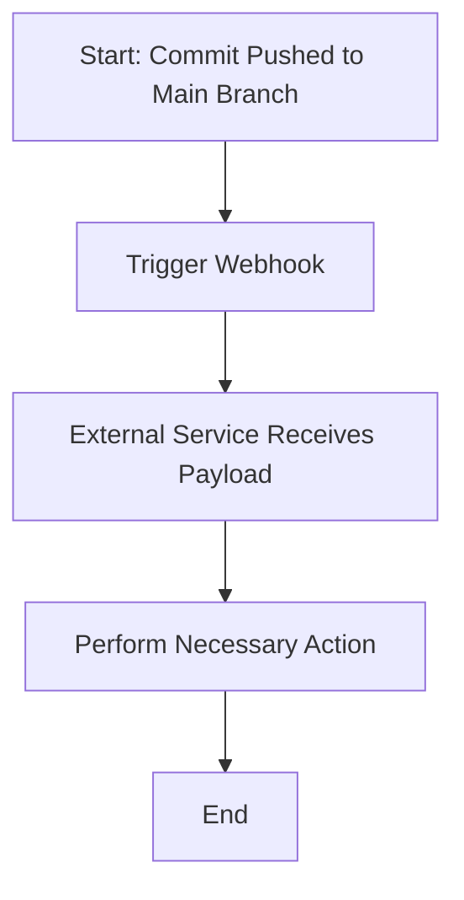
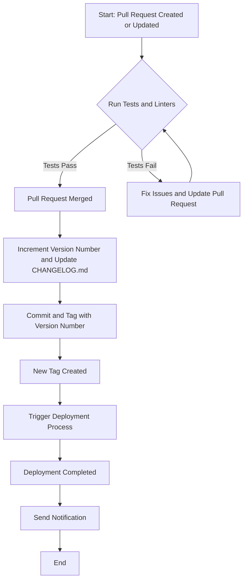

# Resume

This is my personal resume data; It is based on an extension of the resume.json schema published
by https://jsonresume.org .

## Versioning
It is follow sem ver versioning; let's define what constitutes a MAJOR, MINOR, and PATCH change in the context of the [resume.yml](resume.yml) file:
- **MAJOR**: A major change would be a significant addition or modification to the resume. This could include adding a new job or education entry, or making a significant change to an existing entry. For example, changing the job title or the institution of an education entry would be considered a major change.
- **MINOR**: A minor change would be a small addition or modification that doesn't significantly alter the existing information. This could include adding new responsibilities or achievements to a job entry, or adding a new certification. These changes are backward compatible as they don't alter the existing structure or content in a significant way.
- **PATCH**: A patch change would be a small fix that doesn't add new information or significantly alter existing information. This could include fixing a typo, making a small change to the formatting, or rephrasing existing content without changing its meaning.
These definitions should be used as a guide when deciding how to increment the version number based on the changes made to the resume.json file.

## Webhooks and Notifications

In this project, I use GitHub `webhooks` to keep external services updated with changes to the main branch. While these external services could `pull` updates from GitHub, this could lead to a high number of requests. To mitigate this, these services might introduce a cache. However, this cache needs to be invalidated when new changes are made to the main branch. To facilitate this, I provide a `push` behavior using webhooks. This allows me to notify these external services when changes occur, enabling them to invalidate their cache and pull the latest changes.

Here's a simplified workflow:

In this workflow:
1. A commit is pushed to the main branch.
2. This triggers the webhook.
3. The external service receives the payload from GitHub.
4. The external service performs the necessary action (e.g., sending a notification).
5. The process ends.

### How?
To set up a webhook on GitHub, follow these steps:

1. Go to the main page of your GitHub repository and click on "Settings".
2. In the left sidebar, click on "Webhooks".
3. Click on "Add webhook".
4. In the "Payload URL" field, enter the URL where you want GitHub to send the payloads.
5. In the "Content type" field, select how you want the data to be sent. Usually, this is "application/json".
6. In the "Secret" field, you can enter a secret token. This token will be sent with the payload, and the receiving server can use it to verify that the payload is indeed from GitHub.
7. In the "Which events would you like to trigger this webhook?" section, select the events that should trigger the webhook.
8. Click on "Add webhook" to save your changes.

Now, whenever the selected events happen in your repository, GitHub will send a payload to the URL you specified. Your external service can then use this payload to perform whatever action is necessary.

## CI/CD

### Requirements:

- git `main` branch must only composed of released versions (tags)
- each change ending merged in main needs to:
	- change the semver version number
	- update the change log with corresponding description
	- tag that commit with corresponding version number

