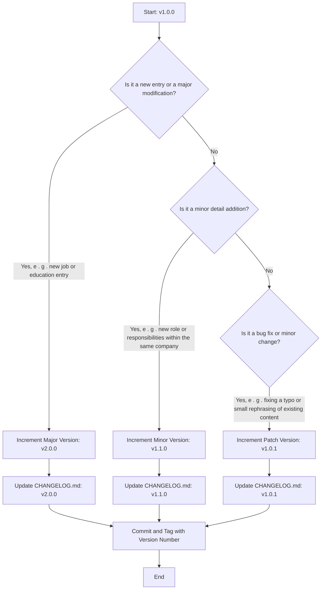

# suddenlyGiovanni's Résumé

This is my personal [résumé.yml](src/resume.yml);
It is written in yml and strictly adheres to the [schema-resume.json](src/schema.json).
The résumé is manually authored following the versioning strategy described below; whereas the
`resume-schema.json` is automatically derived from the [
`@suddenlygiovanni/schema-resume`](../schema-resume/README.md)
package.

## Versioning

It is follow sem ver versioning; let's define what constitutes a MAJOR, MINOR, and PATCH change in
the context of the [resume.yml](resume.yml) file:

- **MAJOR**: A major change would be a significant addition or modification to the resume. This
	could include adding a new job or education entry, or making a significant change to an existing
	entry. For example, changing the job title or the institution of an education entry would be
	considered a major change.
- **MINOR**: A minor change would be a small addition or modification that doesn't significantly
	alter the existing information. This could include adding new responsibilities or achievements to
	a job entry, or adding a new certification. These changes are backward compatible as they don't
	alter the existing structure or content in a significant way.
- **PATCH**: A patch change would be a small fix that doesn't add new information or significantly
	alter existing information. This could include fixing a typo, making a small change to the
	formatting, or rephrasing existing content without changing its meaning.
	These definitions should be used as a guide when deciding how to increment the version number
	based on the changes made to the resume.json file.

